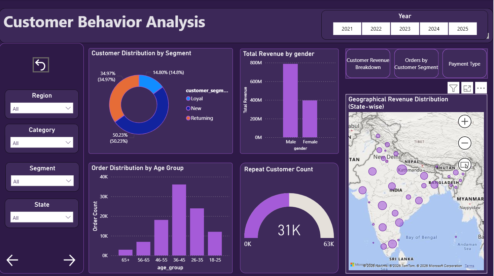

# 🛒 E-Commerce Sales Performance Analysis

## 📌 Project Overview
Built an end-to-end data analysis pipeline to analyze e-commerce sales performance and generate actionable business insights using Python, SQL, and Power BI.

This project focuses on understanding customer behavior, product performance, pricing strategies, and delivery efficiency to improve overall business outcomes.

---

## 🎯 Objectives
- Analyze customer purchasing behavior and satisfaction
- Identify top-performing products and categories
- Evaluate pricing and revenue trends
- Assess delivery performance and payment methods

---

## 🛠️ Tools & Technologies
- **Python**: Pandas, NumPy, Matplotlib, Seaborn, Scikit-learn  
- **SQL**: Data extraction, JOIN operations, KPI calculations  
- **Power BI**: Interactive dashboards and KPI visualization  
- **Statistics**: T-Test, Z-Test, Chi-Square, ANOVA  
- **Machine Learning**: Regression, Classification, Clustering  

---

## 📊 Key Insights
- Furniture category generates the highest revenue  
- UPI is the most preferred payment method  
- Customers show high satisfaction (mostly 4–5 ratings)  
- Sales show strong seasonal trends  
- Loyal customers contribute more to revenue  

---

## 🤖 Machine Learning Models
- **Linear Regression** → Strong revenue prediction (R² ≈ 0.90)  
- **KNN Classification** → Good recall performance  
- **K-Means Clustering** → Well-defined customer segments  

---

## 📊 Dashboard Preview

---

## 💼 Business Impact
- Identified high-revenue product categories  
- Analyzed customer behavior for better targeting  
- Provided insights for pricing and marketing strategies  
- Improved decision-making using data-driven insights  

---

## 📂 Project Structure
